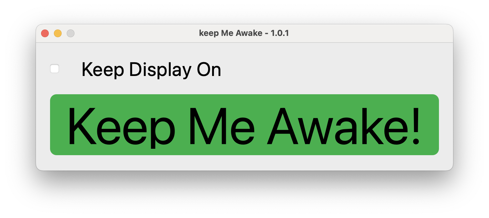

# Keep Me Awake for macOS

**Keep Me Awake** is a lightweight macOS app that prevents your Mac from sleeping, using the native `caffeinate` command. Whether you're downloading files, giving a presentation, or running long processes, this tool keeps your Mac awake — with or without the display.

## Features

- Prevents your Mac from going to sleep automatically
- Choose whether to keep the **system only** or **both system and display** awake
- Built with a clean and minimal **PyQt6** interface

## Modes

You can select between two modes:

- **System only**: keeps the system awake, allows display to sleep
- **System + Display**: keeps both system and display awake

## Screenshot

## License

This software is licensed under the **GNU General Public License v3.0 (GPLv3)**.  
You are free to use, modify, and distribute it under the terms of the license.

## Author

**Simone De Angelis**
